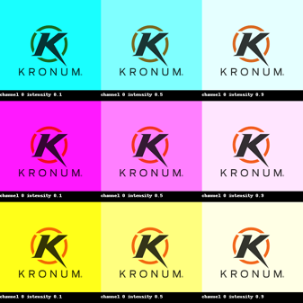

# Image color filter

### Description:

The program takes a photo and applies a filter with 3 different colors and with 3 different intensities for each color returning a new image with 9 copies of the initial image with the different colors and tones previously applied.

### Necessary libraries:

- Pillow

### Exemple:

#### Input image:

#### Output image:

